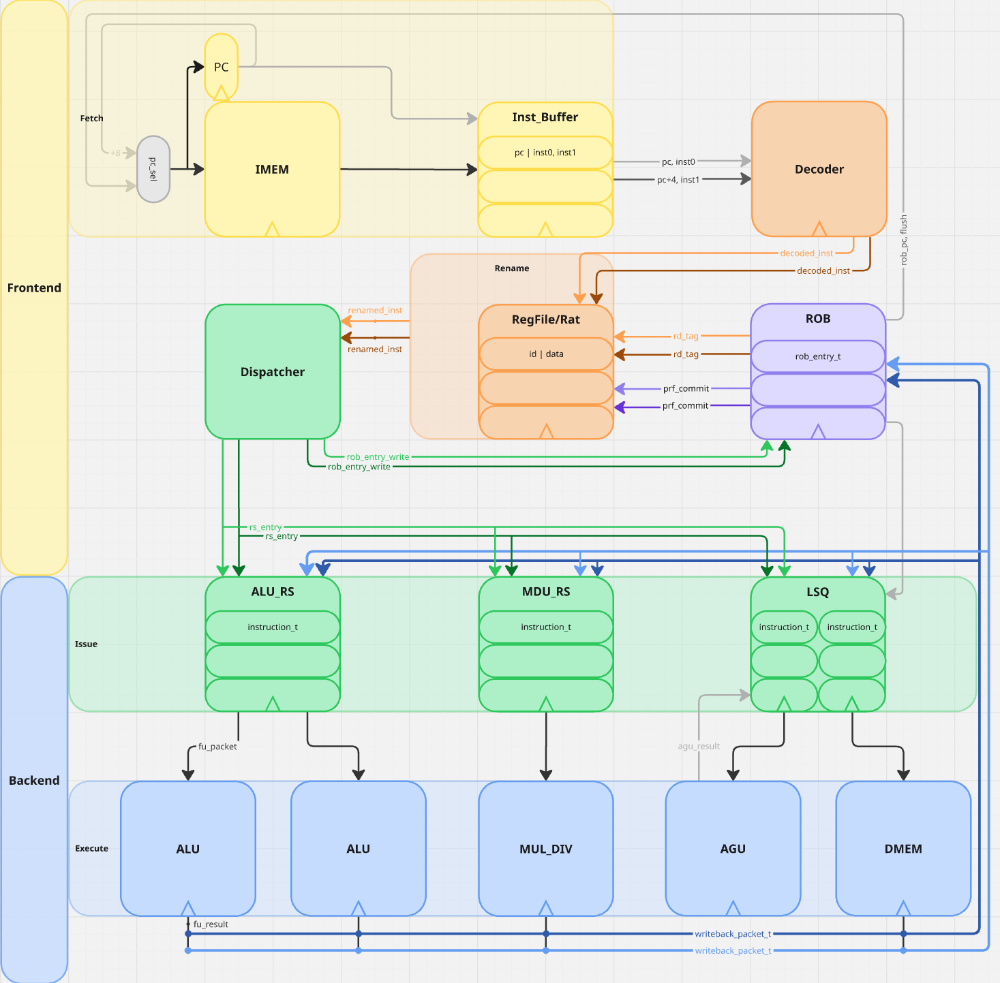

# riscv-oom (Out-of-Order Machine)
### A Dual-Issue Out-of-Order RISC-V Core

This repository contains the SystemVerilog implementation of a dual-issue, 8-stage, out-of-order RISC-V processor. This core was developed as part of an MSEE project in advanced computer architecture at San Jose State University. It implements the RV32IM integer and multiplication/division instruction set extensions and uses a speculative execution engine based on the Tomasulo algorithm with a Reorder Buffer (ROB) for in-order retirement.

**Authors:** Jason, Huynh, Yash Khatavkar, Chandra Nikhita Mala

---

## Documentation

| Resource | Link |
|----------|------|
| **Design Report** | [Google Docs](https://docs.google.com/document/d/1v8009SSoZWuLg49KPPewzCdCRJDRssA9Mc9EvM62rFk/edit?usp=sharing) |
| **Presentation Slides** | [Google Slides](https://docs.google.com/presentation/d/1yW3-KL_G7R-FjGdJF94s4NILHCeElwhgHRLKfTuBBA4/edit?usp=sharing) |

---

## Block Diagram



---

## Core Features

| Feature | Specification |
|---------|---------------|
| **ISA** | RISC-V RV32IM (32-bit Base Integer + Multiply/Divide) |
| **Execution Model** | Speculative Out-of-Order Execution, In-Order Commit |
| **Issue Width** | 2-Wide Superscalar |
| **Pipeline Depth** | 8 Stages |
| **Register Renaming** | ROB-based with unified PRF/RAT (Data-in-RS model) |
| **Reservation Stations** | Unified, parameterized NxM allocation and issue |
| **Load/Store Queue** | Split Load RS and Store FIFO with memory disambiguation |
| **Functional Units** | 2 ALU, 1 MDU, 1 AGU, 1 DMEM port |
| **ROB Entries** | Parameterized (default 32) |
| **Branch Prediction** | Static predict-not-taken |

---

## Pipeline Stages

The processor implements an 8-stage pipeline divided into frontend and backend:

| Stage | Function |
|-------|----------|
| **1. Fetch** | PC generation, I-cache access, 2 instructions per cycle |
| **2. Instruction Buffer** | FIFO buffering (4 entries), stall decoupling |
| **3. Decode** | Instruction decode, immediate generation, micro-op selection |
| **4. Rename/Dispatch** | PRF read, RAT update, ROB allocation, RS dispatch, operand bypass |
| **5. Issue** | Operand readiness check, age-based selection, CDB snoop and wake-up |
| **6. Execute** | ALU ops, multiply/divide, branch resolution, address generation |
| **7. Writeback** | CDB arbitration (age-based priority), result broadcast |
| **8. Commit** | In-order retirement, architectural state update, flush on mispredict |

---

## Microarchitecture

### Frontend

**Fetch Stage** generates the PC and fetches 2 instructions per cycle aligned on 8-byte boundaries. PC selection prioritizes ROB redirect (mispredict/exception) over sequential PC+8.

**Instruction Buffer** is a FIFO that decouples fetch from decode using count-based full/empty detection. Stores 4 entries with 2 instructions and 1 PC per entry.

**Decode Stage** extracts instruction fields, generates immediates, and produces control signals for all RV32IM formats (R, I, S, B, U, J).

**Rename/Dispatch Stage** performs register renaming using a unified Physical Register File (PRF) with integrated Register Alias Table (RAT). The combined stage executes in a single cycle:
- ROB entry allocation (combinational grant)
- RAT lookup and speculative update  
- Operand bypass (intra-group → ROB → CDB → commit → PRF)
- Reservation station dispatch with compaction

### Backend

**Reservation Stations** are parameterized for NxM allocation/issue:
- ALU RS: 8 entries, 2-wide dispatch, 2-wide issue
- MDU RS: 4 entries, 2-wide dispatch, 1-wide issue

Issue selection uses age-based priority computed as distance from ROB head to handle circular buffer wrap-around correctly.

**Execution Units:**
- 2× ALU: Single-cycle integer arithmetic and logic
- 1× MDU: 2-stage pipelined Wallace-tree multiplier, iterative shift-subtract divider
- 1× AGU: Address generation for loads/stores

**Load/Store Queue** uses a split architecture:
- Load Queue: Out-of-order issue with memory disambiguation
- Store Queue: FIFO, in-order commit
- Store-to-load forwarding when addresses match (Incomplete)
- Loads stall if older store has unknown or matching address

**Common Data Bus** arbitrates between functional units using age-based priority. Supports 2 concurrent broadcasts per cycle.

**Reorder Buffer** is a circular buffer managing:
- Single-cycle allocation (grant → dispatch write same cycle)
- CDB snoop for result capture
- In-order commit of up to 2 instructions per cycle
- Pipeline flush on branch mispredict, jump, or exception

### Bypass Network

Multiple bypass paths ensure correct forwarding for back-to-back dependencies:

| Priority | Bypass Path | Description |
|----------|-------------|-------------|
| 1 | Intra-group | inst[0].rd → inst[1].rs (same cycle) |
| 2 | ROB | Completed results (is_ready=1) in ROB |
| 3 | CDB | Results broadcasting this cycle |
| 4 | Commit | Results committing this cycle |
| 5 | PRF | Already committed values |

---

## Results

### Performance

| Benchmark | IPC | Notes |
|-----------|-----|-------|
| RV32IM ISA Test | 0.45 | Unrealistic Heavy branching with thrash like behavior, 8+ cycle misprediction penalty |
| Matrix Multiply | 1.50 | Demonstrates >1 IPC capability |

### Verification

- Module-level testbenches for each pipeline stage
- 182 M-extension tests covering all sign combinations
- System-level tests using custom assembler
- Waveform verification of 2-wide OoO execute and in-order commit

---

## Future Work

- [ ] Branch prediction (2-bit saturating counter BTB)
- [ ] L1 instruction and data caches
- [ ] Further RISC-V extension support (RV32GC)
- [ ] Wider issue (3-wide)

---

## Building and Running

```bash
# This project was completed utilizing Xilinx's Vivado and Python3. For best compatability please use so.
# Vivado build files are not provided, please add sources and run cpu_tb.sv for system level test.
# Test Case 0 runs rv32im_test, Case 1 runs 4x4 matmul_test

# Run Python Compiler Script (Modify cpu_tb's TEST_FILE parameter to run your own assembly and set testcase to 2)
python3 riscv_assembler.py input_file.s [output_file.hex]

```

---

## Repository Structure

```
── docs
│   └── block_diagram.png
├── README.md
├── rtl
│   ├── 1-fetch
│   │   ├── fetch.sv
│   │   └── inst_buffer.sv
│   ├── 2-decode
│   │   └── decode.sv
│   ├── 3-rename
│   │   ├── prf.sv
│   │   └── rename.sv
│   ├── 4-dispatch
│   │   └── dispatch.sv
│   ├── 5-issue
│   │   ├── issue.sv
│   │   ├── lsq.sv
│   │   ├── reservation_station.sv
│   │   └── tbs
│   │       └── *.sv
│   ├── 6-execute
│   │   ├── *.sv
│   │   ├── agu.sv
│   │   ├── alu.sv
│   │   ├── execute.sv
│   │   └── mdu.sv
│   ├── 7-writeback
│   │   └── cdb.sv
│   ├── 8-commit
│   │   └── rob.sv
│   ├── common
│   │   ├── regs.sv
│   │   ├── riscv_isa_pkg.sv
│   │   └── uarch_pkg.sv
│   ├── core.sv
│   ├── cpu.sv #TOP
│   └── memory
│       └── mem_simple.sv
└── sim
    ├── tb
    │   ├── *.sv
    │   └── cpu_tb.sv
    └── tests
        ├── fetch_test.hex
        ├── matmul_test.hex
        ├── matmul_test.s
        ├── riscv_assembler.py
        ├── rv32im_test.hex
        └── rv32im_test.s

```

---

## References

1. Hennessy, J. L., & Patterson, D. A. (2017). *Computer Architecture: A Quantitative Approach* (6th ed.). Morgan Kaufmann.
2. RISC-V Foundation. *The RISC-V Instruction Set Manual, Volume I: Unprivileged ISA*.

---
