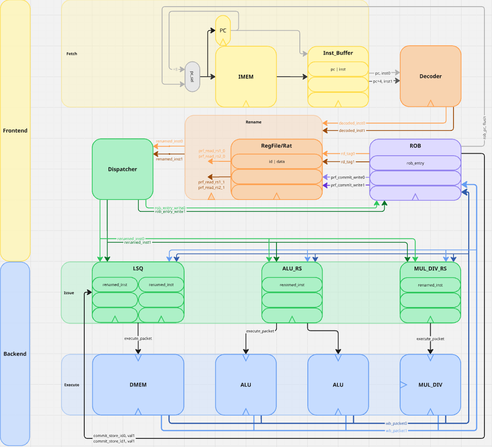

# riscv-oom (Out-of-Order Machine):  A Dual-Issue Out-of-Order RISC-V Core

This repository contains the Verilog implementation of a dual-issue, 8-stage, out-of-order RISC-V processor. This core is designed as part of an MSEE project in advanced computer architecture. It implements the RV32IM integer and multiplication/division instruction set extensions and uses a speculative execution engine based on the Tomasulo algorithm with a Reorder Buffer (ROB) for in-order retirement.

***

## Core Features

* **ISA:** RISC-V 32-bit (RV32IM)
* **Execution:** Speculative Out-of-Order Execution with In-Order Commit.
* **Issue Width:** Dual-Issue (up to two instructions per cycle).
* **Pipeline:** 8-Stage speculative pipeline.
* **Branch Prediction:** Static predict-not-taken model.
* **Frontend:** Decoupled Fetch and Decode stages with an Instruction Buffer to hide memory latency.
* **Renaming:** Register Renaming is performed using a unified Register Alias Table (RAT) and Physical Register File, with a Reorder Buffer (ROB) providing instruction tags.
* **Backend Queues:**
    * 1 Unified ALU Reservation Station (RS)
    * 1 Dedicated MUL/DIV Reservation Station (RS)
    * 2 Load-Store Queues (LSQ) (Load RS, Store Queue)
* **Functional Units:**
    * 2 Arithmetic Logic Units (ALUs) for integer and branch operations.
    * 1 Dedicated Multiplier/Divider Unit.
    * 1 Memory Unit for loads and stores.
* **Writeback:** Dual Common Data Buses (CDB) for result broadcasting.

***

## Pipeline Stages

The processor implements the following 8-stage pipeline:

1.  **Fetch:** Fetches a 64-bit packet from the Instruction Memory into a buffer.
2.  **Decode:** Decodes up to two instructions in parallel.
3.  **Rename:** Resolves register dependencies by mapping architectural to physical registers (ROB tags).
4.  **Dispatch:** Routes renamed instructions to the appropriate Reservation Station or Load-Store Queue.
5.  **Issue:** Selects ready instructions from the RS/LSQ to send to a free Functional Unit.
6.  **Execute:** Performs the actual calculation or memory address generation.
7.  **Writeback:** Broadcasts the result and its ROB tag on one of the two Common Data Buses.
8.  **Commit:** Retires instructions in-order, writing results to the architectural register file and handling mispredictions.

***

